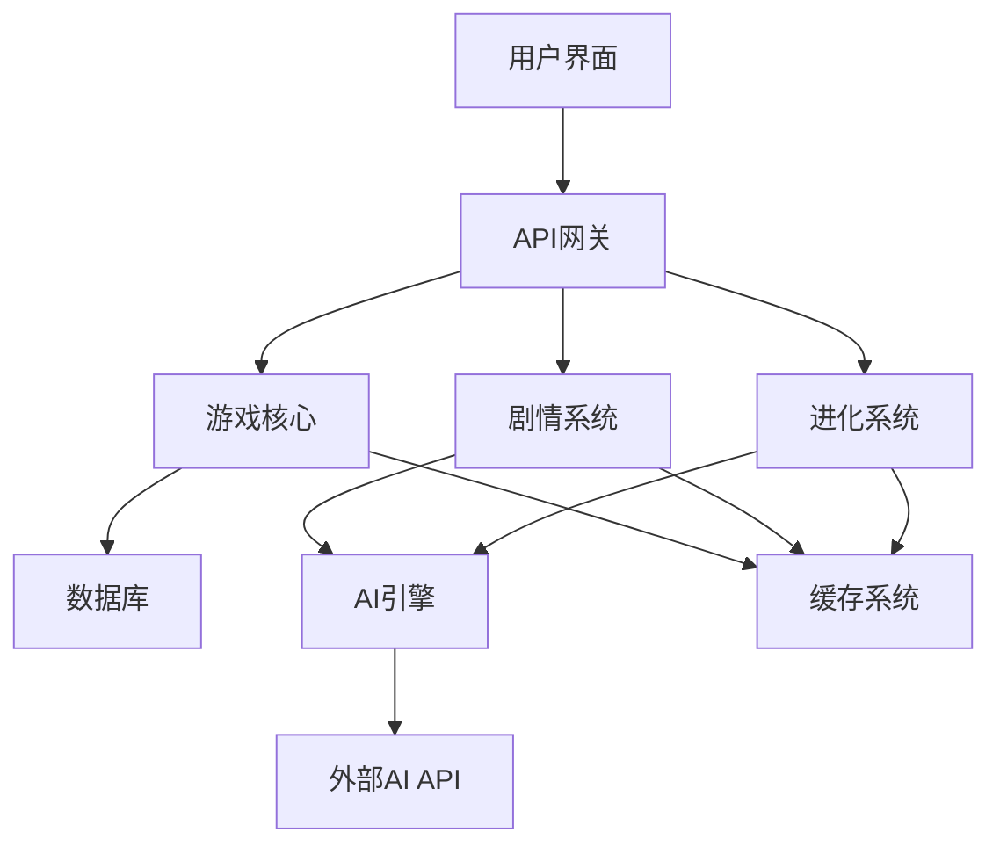

# 《灵境斗宠录》技术实现文档

**版本**: 2.0.0 - 世界树纪元  
**作者**: 树枝 (微信: wzq8083)  
**创建日期**: 2025年9月26日  

---

## 📋 目录

1. [系统架构](#系统架构)
2. [核心模块实现](#核心模块实现)
3. [数据库设计](#数据库设计)
4. [API接口设计](#api接口设计)
5. [前端架构](#前端架构)
6. [AI集成方案](#ai集成方案)
7. [部署方案](#部署方案)
8. [性能优化](#性能优化)

---

## 🏗️ 系统架构

### 整体架构图

```
┌─────────────────────────────────────────────────────────────┐
│                        用户界面层                              │
├─────────────────────────────────────────────────────────────┤
│  Web前端 (HTML5/CSS3/JS)  │  移动端 (未来)  │  Steam客户端 (未来) │
├─────────────────────────────────────────────────────────────┤
│                        API网关层                              │
├─────────────────────────────────────────────────────────────┤
│  Express.js路由  │  中间件系统  │  错误处理  │  安全验证        │
├─────────────────────────────────────────────────────────────┤
│                       业务逻辑层                              │
├─────────────────────────────────────────────────────────────┤
│  游戏核心  │  剧情系统  │  进化系统  │  AI引擎  │  战斗系统      │
├─────────────────────────────────────────────────────────────┤
│                        数据访问层                             │
├─────────────────────────────────────────────────────────────┤
│  SQLite数据库  │  文件存储  │  缓存系统  │  外部API集成        │
└─────────────────────────────────────────────────────────────┘
```

### 模块依赖关系



---

## 🔧 核心模块实现

### 1. 游戏核心系统 (src/game/)

#### PetManager.js - 宠物管理器
```javascript
class PetManager {
    constructor(database, aiEngine) {
        this.db = database;
        this.aiEngine = aiEngine;
        this.petCache = new Map();
    }

    // 创建宠物
    async createPet(template, playerId) {
        const pet = {
            id: this.generateId(),
            playerId: playerId,
            name: template.name,
            species: template.species,
            rarity: template.rarity,
            level: 1,
            exp: 0,
            stats: { ...template.baseStats },
            traits: [...template.traits],
            personality: template.personality,
            mood: 'neutral',
            bond: 0,
            createdAt: new Date().toISOString()
        };

        await this.db.pets.create(pet);
        this.petCache.set(pet.id, pet);
        return pet;
    }

    // 更新宠物属性
    async updatePet(petId, updates) {
        const pet = await this.getPet(petId);
        if (!pet) throw new Error('宠物不存在');

        Object.assign(pet, updates);
        await this.db.pets.update(petId, pet);
        this.petCache.set(petId, pet);
        
        return pet;
    }

    // 宠物升级
    async levelUp(petId) {
        const pet = await this.getPet(petId);
        if (!pet) throw new Error('宠物不存在');

        pet.level += 1;
        pet.exp = 0;
        
        // 属性成长
        const growth = this.calculateStatGrowth(pet);
        Object.keys(growth).forEach(stat => {
            pet.stats[stat] += growth[stat];
        });

        await this.updatePet(petId, pet);
        return pet;
    }
}
```

#### BattleSystem.js - 战斗系统
```javascript
class BattleSystem {
    constructor(database) {
        this.db = database;
        this.battleCache = new Map();
    }

    // 创建战斗
    async createBattle(playerPet, enemyPet, battleType = 'wild') {
        const battle = {
            id: this.generateBattleId(),
            playerPet: playerPet,
            enemyPet: enemyPet,
            type: battleType,
            turn: 1,
            phase: 'preparation',
            log: [],
            startTime: Date.now()
        };

        this.battleCache.set(battle.id, battle);
        return battle;
    }

    // 执行回合
    async executeTurn(battleId, playerAction) {
        const battle = this.battleCache.get(battleId);
        if (!battle) throw new Error('战斗不存在');

        // 计算行动顺序
        const actionOrder = this.calculateActionOrder(
            battle.playerPet, 
            battle.enemyPet
        );

        // 执行行动
        for (const actor of actionOrder) {
            if (actor.isPlayer) {
                await this.executePlayerAction(battle, playerAction);
            } else {
                await this.executeEnemyAction(battle);
            }

            // 检查战斗结束条件
            if (this.checkBattleEnd(battle)) {
                break;
            }
        }

        battle.turn += 1;
        return battle;
    }

    // 计算伤害
    calculateDamage(attacker, defender, skill) {
        const baseDamage = attacker.stats.attack * skill.power;
        const defense = defender.stats.defense;
        const typeModifier = this.getTypeModifier(skill.type, defender.type);
        
        const damage = Math.max(1, 
            Math.floor((baseDamage - defense * 0.5) * typeModifier)
        );

        return damage;
    }
}
```

### 2. 剧情系统 (src/story/)

#### StoryEngine.js - 剧情引擎
```javascript
class StoryEngine {
    constructor() {
        this.storyDatabase = new StoryDatabase();
        this.currentStory = null;
        this.storyHistory = [];
        this.triggers = new Map();
        
        this.initializeTriggers();
    }

    // 触发剧情
    async triggerStory(triggerType, context) {
        const handler = this.triggers.get(triggerType);
        if (!handler) {
            console.warn(`未知的剧情触发器: ${triggerType}`);
            return null;
        }

        try {
            const story = await handler(context);
            if (story) {
                this.currentStory = story;
                this.storyHistory.push({
                    story: story,
                    context: context,
                    timestamp: Date.now()
                });
            }
            return story;
        } catch (error) {
            console.error(`剧情生成失败: ${triggerType}`, error);
            return null;
        }
    }

    // 处理进化剧情
    async handleEvolutionStory(context) {
        const { pet, evolutionType, newForm } = context;
        
        // 选择剧情模板
        const template = this.selectEvolutionTemplate(evolutionType);
        
        // 生成个性化内容
        const story = await this.generateStoryFromTemplate(template, {
            petName: pet.name,
            petSpecies: pet.species,
            evolutionType: evolutionType,
            newForm: newForm
        });

        // 添加世界观背景
        story.worldContext = this.getWorldContext(evolutionType);
        
        return story;
    }

    // 生成故事内容
    async generateStoryFromTemplate(template, variables) {
        const story = {
            title: this.replaceVariables(template.title, variables),
            type: template.type,
            scenes: []
        };

        for (const scene of template.scenes) {
            const processedScene = {
                type: scene.type,
                content: this.replaceVariables(scene.content, variables)
            };

            if (scene.choices) {
                processedScene.choices = scene.choices.map(choice => ({
                    ...choice,
                    text: this.replaceVariables(choice.text, variables)
                }));
            }

            story.scenes.push(processedScene);
        }

        return story;
    }
}
```

### 3. 进化系统 (src/game/EvolutionSystem.js)

#### 三层AI架构实现
```javascript
class ThreeLayerEvolutionSystem {
    constructor() {
        this.L1_RecordLayer = new L1RecordLayer();
        this.L2_EvolutionLayer = new L2EvolutionLayer();
        this.L3_JudgmentLayer = new L3JudgmentLayer();
        
        this.evolutionTrees = new Map();
        this.behaviorWeights = this.initializeBehaviorWeights();
    }

    // L1层：记录行为
    recordBehavior(petId, behaviorType, context) {
        const behaviorData = {
            petId: petId,
            type: behaviorType,
            context: context,
            timestamp: Date.now(),
            weight: this.calculateBehaviorWeight(behaviorType, context)
        };

        this.L1_RecordLayer.addRecord(behaviorData);
        
        // 触发L2层分析
        this.scheduleAnalysis(petId);
    }

    // L2层：分析进化倾向
    async analyzeEvolutionTendency(petId) {
        const behaviors = this.L1_RecordLayer.getBehaviors(petId);
        const tendencies = this.L2_EvolutionLayer.analyzeTendencies(behaviors);
        
        // 计算进化概率
        const evolutionPaths = this.calculateEvolutionPaths(petId, tendencies);
        
        return {
            tendencies: tendencies,
            evolutionPaths: evolutionPaths,
            confidence: this.calculateConfidence(behaviors)
        };
    }

    // L3层：最终决策
    async makeEvolutionDecision(petId, analysisResult) {
        const pet = await this.getPet(petId);
        const decision = this.L3_JudgmentLayer.makeDecision(
            pet, 
            analysisResult,
            this.getEvolutionConstraints(pet)
        );

        if (decision.approved) {
            return await this.executeEvolution(petId, decision.evolutionPath);
        }

        return { success: false, reason: decision.reason };
    }

    // 执行进化
    async executeEvolution(petId, evolutionPath) {
        const pet = await this.getPet(petId);
        
        // 应用进化变化
        const newPet = this.applyEvolution(pet, evolutionPath);
        
        // 更新数据库
        await this.updatePet(petId, newPet);
        
        // 记录进化历史
        this.recordEvolutionHistory(petId, evolutionPath);
        
        return { success: true, newPet: newPet };
    }
}
```

---

## 🗄️ 数据库设计

### SQLite数据库结构

#### 1. 玩家表 (players)
```sql
CREATE TABLE players (
    id INTEGER PRIMARY KEY AUTOINCREMENT,
    username VARCHAR(50) UNIQUE NOT NULL,
    email VARCHAR(100),
    level INTEGER DEFAULT 1,
    exp INTEGER DEFAULT 0,
    coins INTEGER DEFAULT 1000,
    gems INTEGER DEFAULT 0,
    created_at DATETIME DEFAULT CURRENT_TIMESTAMP,
    last_login DATETIME,
    settings TEXT -- JSON格式的设置
);
```

#### 2. 宠物表 (pets)
```sql
CREATE TABLE pets (
    id INTEGER PRIMARY KEY AUTOINCREMENT,
    player_id INTEGER NOT NULL,
    name VARCHAR(50) NOT NULL,
    species VARCHAR(50) NOT NULL,
    rarity VARCHAR(10) NOT NULL, -- N, R, SR, SSR, SSS
    level INTEGER DEFAULT 1,
    exp INTEGER DEFAULT 0,
    hp INTEGER NOT NULL,
    attack INTEGER NOT NULL,
    defense INTEGER NOT NULL,
    speed INTEGER NOT NULL,
    magic INTEGER NOT NULL,
    mood VARCHAR(20) DEFAULT 'neutral',
    bond INTEGER DEFAULT 0,
    traits TEXT, -- JSON数组
    personality TEXT,
    evolution_stage INTEGER DEFAULT 0,
    created_at DATETIME DEFAULT CURRENT_TIMESTAMP,
    FOREIGN KEY (player_id) REFERENCES players(id)
);
```

#### 3. 行为记录表 (behavior_records)
```sql
CREATE TABLE behavior_records (
    id INTEGER PRIMARY KEY AUTOINCREMENT,
    pet_id INTEGER NOT NULL,
    behavior_type VARCHAR(50) NOT NULL,
    context TEXT, -- JSON格式的上下文
    weight REAL DEFAULT 1.0,
    timestamp DATETIME DEFAULT CURRENT_TIMESTAMP,
    FOREIGN KEY (pet_id) REFERENCES pets(id)
);
```

#### 4. 进化历史表 (evolution_history)
```sql
CREATE TABLE evolution_history (
    id INTEGER PRIMARY KEY AUTOINCREMENT,
    pet_id INTEGER NOT NULL,
    from_species VARCHAR(50) NOT NULL,
    to_species VARCHAR(50) NOT NULL,
    evolution_type VARCHAR(50) NOT NULL,
    trigger_conditions TEXT, -- JSON格式
    timestamp DATETIME DEFAULT CURRENT_TIMESTAMP,
    FOREIGN KEY (pet_id) REFERENCES pets(id)
);
```

#### 5. 剧情进度表 (story_progress)
```sql
CREATE TABLE story_progress (
    id INTEGER PRIMARY KEY AUTOINCREMENT,
    player_id INTEGER NOT NULL,
    story_id VARCHAR(100) NOT NULL,
    progress INTEGER DEFAULT 0,
    choices TEXT, -- JSON数组记录选择
    completed BOOLEAN DEFAULT FALSE,
    started_at DATETIME DEFAULT CURRENT_TIMESTAMP,
    completed_at DATETIME,
    FOREIGN KEY (player_id) REFERENCES players(id)
);
```

#### 6. 战斗记录表 (battle_records)
```sql
CREATE TABLE battle_records (
    id INTEGER PRIMARY KEY AUTOINCREMENT,
    player_id INTEGER NOT NULL,
    pet_id INTEGER NOT NULL,
    enemy_type VARCHAR(50) NOT NULL,
    enemy_level INTEGER NOT NULL,
    result VARCHAR(20) NOT NULL, -- victory, defeat, draw
    duration INTEGER, -- 战斗持续时间(秒)
    exp_gained INTEGER DEFAULT 0,
    rewards TEXT, -- JSON格式的奖励
    battle_log TEXT, -- JSON格式的战斗日志
    timestamp DATETIME DEFAULT CURRENT_TIMESTAMP,
    FOREIGN KEY (player_id) REFERENCES players(id),
    FOREIGN KEY (pet_id) REFERENCES pets(id)
);
```

### 数据库索引优化
```sql
-- 性能优化索引
CREATE INDEX idx_pets_player_id ON pets(player_id);
CREATE INDEX idx_behavior_records_pet_id ON behavior_records(pet_id);
CREATE INDEX idx_behavior_records_timestamp ON behavior_records(timestamp);
CREATE INDEX idx_evolution_history_pet_id ON evolution_history(pet_id);
CREATE INDEX idx_story_progress_player_id ON story_progress(player_id);
CREATE INDEX idx_battle_records_player_id ON battle_records(player_id);
CREATE INDEX idx_battle_records_timestamp ON battle_records(timestamp);
```

---

## 🔌 API接口设计

### RESTful API规范

#### 基础路径
```
基础URL: https://api.lingjing-game.com/v1
认证方式: Bearer Token (未来版本)
响应格式: JSON
```

#### 1. 宠物相关接口

##### 获取宠物列表
```http
GET /api/pets
Authorization: Bearer {token}

Response:
{
    "success": true,
    "data": [
        {
            "id": 1,
            "name": "小火龙",
            "species": "火龙",
            "rarity": "R",
            "level": 5,
            "stats": { "hp": 100, "attack": 35, ... },
            "mood": "happy",
            "bond": 25
        }
    ],
    "total": 1
}
```

##### 召唤宠物
```http
POST /api/pets/summon
Content-Type: application/json

Request:
{
    "summonType": "random", // random, legendary, stable, keyword
    "keyword": "龙", // 仅keyword类型需要
    "playerId": 1
}

Response:
{
    "success": true,
    "data": {
        "pet": { ... },
        "isNew": true,
        "rarity": "SR"
    }
}
```

##### 宠物进化
```http
POST /api/pets/{petId}/evolve
Content-Type: application/json

Request:
{
    "evolutionPath": "power_evolution",
    "confirm": true
}

Response:
{
    "success": true,
    "data": {
        "pet": { ... },
        "evolutionStory": { ... },
        "newAbilities": [ ... ]
    }
}
```

#### 2. 剧情相关接口

##### 触发剧情
```http
POST /api/story/trigger
Content-Type: application/json

Request:
{
    "triggerType": "pet_evolution",
    "context": {
        "petId": 1,
        "evolutionType": "power_evolution"
    }
}

Response:
{
    "success": true,
    "data": {
        "story": {
            "title": "力量的觉醒",
            "scenes": [ ... ],
            "choices": [ ... ]
        }
    }
}
```

##### 提交剧情选择
```http
POST /api/story/choice
Content-Type: application/json

Request:
{
    "storyId": "story_123",
    "choiceId": "choice_1",
    "playerId": 1
}

Response:
{
    "success": true,
    "data": {
        "nextScene": { ... },
        "effects": { ... },
        "rewards": [ ... ]
    }
}
```

#### 3. AI相关接口

##### 生成AI对话
```http
POST /api/ai/chat
Content-Type: application/json

Request:
{
    "petId": 1,
    "message": "你好吗？",
    "context": {
        "mood": "happy",
        "recentEvents": [ ... ]
    }
}

Response:
{
    "success": true,
    "data": {
        "response": "我很好，主人！今天的冒险让我很兴奋！",
        "moodChange": "excited",
        "bondIncrease": 1
    }
}
```

##### 进化分析
```http
POST /api/ai/evolution-analysis
Content-Type: application/json

Request:
{
    "petId": 1,
    "behaviorHistory": [ ... ]
}

Response:
{
    "success": true,
    "data": {
        "tendencies": {
            "power": 0.7,
            "wisdom": 0.3,
            "balance": 0.5
        },
        "evolutionPaths": [
            {
                "name": "力量进化",
                "probability": 0.6,
                "requirements": [ ... ]
            }
        ]
    }
}
```

---

## 🎨 前端架构

### 组件化设计

#### 1. 核心组件结构
```
src/frontend/
├── components/
│   ├── GameInterface/
│   │   ├── StoryPanel.js
│   │   ├── PetPanel.js
│   │   ├── ChoicePanel.js
│   │   └── ChatPanel.js
│   ├── PetSystem/
│   │   ├── PetCard.js
│   │   ├── PetStats.js
│   │   ├── EvolutionTree.js
│   │   └── SummonInterface.js
│   ├── StorySystem/
│   │   ├── StoryRenderer.js
│   │   ├── DialogueBox.js
│   │   ├── ChoiceButton.js
│   │   └── StoryHistory.js
│   └── Common/
│       ├── LoadingSpinner.js
│       ├── Modal.js
│       ├── Notification.js
│       └── ProgressBar.js
├── services/
│   ├── ApiService.js
│   ├── GameStateManager.js
│   ├── StorageService.js
│   └── EventBus.js
├── utils/
│   ├── formatters.js
│   ├── validators.js
│   ├── constants.js
│   └── helpers.js
└── styles/
    ├── components/
    ├── themes/
    └── animations/
```

#### 2. 状态管理
```javascript
class GameStateManager {
    constructor() {
        this.state = {
            player: null,
            currentPet: null,
            pets: [],
            currentStory: null,
            storyHistory: [],
            gameSettings: {},
            ui: {
                loading: false,
                activePanel: 'story',
                notifications: []
            }
        };
        
        this.listeners = new Map();
        this.middleware = [];
    }

    // 状态更新
    setState(updates) {
        const oldState = { ...this.state };
        this.state = { ...this.state, ...updates };
        
        // 触发中间件
        this.middleware.forEach(middleware => {
            middleware(oldState, this.state);
        });
        
        // 通知监听器
        this.notifyListeners(oldState, this.state);
    }

    // 订阅状态变化
    subscribe(key, callback) {
        if (!this.listeners.has(key)) {
            this.listeners.set(key, []);
        }
        this.listeners.get(key).push(callback);
    }

    // 取消订阅
    unsubscribe(key, callback) {
        const callbacks = this.listeners.get(key);
        if (callbacks) {
            const index = callbacks.indexOf(callback);
            if (index > -1) {
                callbacks.splice(index, 1);
            }
        }
    }
}
```

#### 3. 事件系统
```javascript
class EventBus {
    constructor() {
        this.events = new Map();
    }

    // 注册事件监听
    on(event, callback) {
        if (!this.events.has(event)) {
            this.events.set(event, []);
        }
        this.events.get(event).push(callback);
    }

    // 触发事件
    emit(event, data) {
        const callbacks = this.events.get(event);
        if (callbacks) {
            callbacks.forEach(callback => {
                try {
                    callback(data);
                } catch (error) {
                    console.error(`事件处理错误 [${event}]:`, error);
                }
            });
        }
    }

    // 移除事件监听
    off(event, callback) {
        const callbacks = this.events.get(event);
        if (callbacks) {
            const index = callbacks.indexOf(callback);
            if (index > -1) {
                callbacks.splice(index, 1);
            }
        }
    }
}
```

---

## 🤖 AI集成方案

### DeepSeek API集成

#### 1. API配置
```javascript
class AIService {
    constructor() {
        this.apiKey = process.env.DEEPSEEK_API_KEY;
        this.baseURL = 'https://api.deepseek.com/v1';
        this.model = 'deepseek-chat';
        this.requestCount = 0;
        this.cache = new Map();
    }

    // 生成剧情内容
    async generateStory(prompt, context = {}) {
        const cacheKey = this.generateCacheKey(prompt, context);
        
        // 检查缓存
        if (this.cache.has(cacheKey)) {
            return this.cache.get(cacheKey);
        }

        try {
            const response = await this.makeRequest({
                model: this.model,
                messages: [
                    {
                        role: 'system',
                        content: this.getSystemPrompt('story_generation')
                    },
                    {
                        role: 'user',
                        content: this.formatPrompt(prompt, context)
                    }
                ],
                max_tokens: 800,
                temperature: 0.8
            });

            const result = this.parseStoryResponse(response);
            
            // 缓存结果
            this.cache.set(cacheKey, result);
            
            return result;
        } catch (error) {
            console.error('AI剧情生成失败:', error);
            return this.getFallbackStory(context);
        }
    }

    // 生成宠物对话
    async generatePetResponse(petData, message, context = {}) {
        const prompt = this.buildPetChatPrompt(petData, message, context);
        
        try {
            const response = await this.makeRequest({
                model: this.model,
                messages: [
                    {
                        role: 'system',
                        content: this.getSystemPrompt('pet_chat')
                    },
                    {
                        role: 'user',
                        content: prompt
                    }
                ],
                max_tokens: 200,
                temperature: 0.9
            });

            return this.parsePetResponse(response, petData);
        } catch (error) {
            console.error('AI对话生成失败:', error);
            return this.getFallbackResponse(petData);
        }
    }

    // 系统提示词
    getSystemPrompt(type) {
        const prompts = {
            story_generation: `
你是《灵境斗宠录》的剧情生成AI。请基于世界树种子衍生的奇幻世界，
结合山海经神话元素，生成富有画面感和沉浸感的文字冒险内容。

要求：
1. 文字优美，富有诗意
2. 情节连贯，逻辑合理
3. 体现山海经文化特色
4. 营造神秘奇幻的氛围
5. 为玩家提供有意义的选择
            `,
            pet_chat: `
你是宠物的AI人格。请根据宠物的种族、性格、心情等信息，
生成符合其特征的对话回应。

要求：
1. 体现宠物的种族特色
2. 反映当前心情状态
3. 保持角色一致性
4. 语言生动有趣
5. 适当表达对主人的感情
            `
        };

        return prompts[type] || '';
    }
}
```

#### 2. 降级机制
```javascript
class AIFallbackSystem {
    constructor() {
        this.templates = this.loadTemplates();
        this.randomResponses = this.loadRandomResponses();
    }

    // 获取备用剧情
    getFallbackStory(context) {
        const templates = this.templates[context.type] || this.templates.default;
        const template = this.selectRandomTemplate(templates);
        
        return this.processTemplate(template, context);
    }

    // 获取备用对话
    getFallbackResponse(petData) {
        const responses = this.randomResponses[petData.species] || 
                         this.randomResponses.default;
        
        return this.selectRandomResponse(responses, petData.mood);
    }

    // 模板处理
    processTemplate(template, context) {
        let content = template.content;
        
        // 变量替换
        Object.keys(context).forEach(key => {
            const regex = new RegExp(`{${key}}`, 'g');
            content = content.replace(regex, context[key]);
        });

        return {
            title: template.title,
            content: content,
            choices: template.choices || []
        };
    }
}
```

---

## 🚀 部署方案

### 1. 开发环境
```yaml
# docker-compose.dev.yml
version: '3.8'
services:
  app:
    build: .
    ports:
      - "3000:3000"
    environment:
      - NODE_ENV=development
      - DATABASE_URL=./data/game.db
    volumes:
      - .:/app
      - /app/node_modules
    command: npm run dev

  database:
    image: sqlite:latest
    volumes:
      - ./data:/data
```

### 2. 生产环境 (Vercel)
```json
// vercel.json
{
  "version": 2,
  "builds": [
    {
      "src": "src/app.js",
      "use": "@vercel/node"
    },
    {
      "src": "public/**/*",
      "use": "@vercel/static"
    }
  ],
  "routes": [
    {
      "src": "/api/(.*)",
      "dest": "/src/app.js"
    },
    {
      "src": "/(.*)",
      "dest": "/public/$1"
    }
  ],
  "env": {
    "NODE_ENV": "production",
    "DEEPSEEK_API_KEY": "@deepseek-api-key"
  }
}
```

### 3. CI/CD流程
```yaml
# .github/workflows/deploy.yml
name: Deploy to Vercel

on:
  push:
    branches: [ main ]
  pull_request:
    branches: [ main ]

jobs:
  test:
    runs-on: ubuntu-latest
    steps:
    - uses: actions/checkout@v2
    - name: Setup Node.js
      uses: actions/setup-node@v2
      with:
        node-version: '18'
    - name: Install dependencies
      run: npm ci
    - name: Run tests
      run: npm test
    - name: Run linting
      run: npm run lint

  deploy:
    needs: test
    runs-on: ubuntu-latest
    if: github.ref == 'refs/heads/main'
    steps:
    - uses: actions/checkout@v2
    - name: Deploy to Vercel
      uses: amondnet/vercel-action@v20
      with:
        vercel-token: ${{ secrets.VERCEL_TOKEN }}
        vercel-org-id: ${{ secrets.ORG_ID }}
        vercel-project-id: ${{ secrets.PROJECT_ID }}
```

---

## ⚡ 性能优化

### 1. 前端优化

#### 代码分割
```javascript
// 动态导入
const StorySystem = lazy(() => import('./components/StorySystem'));
const EvolutionSystem = lazy(() => import('./components/EvolutionSystem'));

// 路由级别的代码分割
const routes = [
    {
        path: '/adventure',
        component: lazy(() => import('./pages/AdventurePage'))
    },
    {
        path: '/pets',
        component: lazy(() => import('./pages/PetsPage'))
    }
];
```

#### 缓存策略
```javascript
class CacheManager {
    constructor() {
        this.memoryCache = new Map();
        this.storageCache = new StorageCache();
        this.maxMemorySize = 50; // MB
    }

    // 设置缓存
    set(key, value, ttl = 3600000) { // 默认1小时
        const item = {
            value: value,
            timestamp: Date.now(),
            ttl: ttl
        };

        this.memoryCache.set(key, item);
        this.storageCache.set(key, item);
        
        this.cleanupExpired();
    }

    // 获取缓存
    get(key) {
        let item = this.memoryCache.get(key);
        
        if (!item) {
            item = this.storageCache.get(key);
            if (item) {
                this.memoryCache.set(key, item);
            }
        }

        if (item && this.isExpired(item)) {
            this.delete(key);
            return null;
        }

        return item ? item.value : null;
    }
}
```

### 2. 后端优化

#### 数据库优化
```javascript
class DatabaseOptimizer {
    constructor(db) {
        this.db = db;
        this.queryCache = new Map();
        this.connectionPool = this.createConnectionPool();
    }

    // 查询缓存
    async cachedQuery(sql, params = [], ttl = 300000) {
        const cacheKey = this.generateQueryKey(sql, params);
        
        if (this.queryCache.has(cacheKey)) {
            const cached = this.queryCache.get(cacheKey);
            if (Date.now() - cached.timestamp < ttl) {
                return cached.result;
            }
        }

        const result = await this.db.all(sql, params);
        
        this.queryCache.set(cacheKey, {
            result: result,
            timestamp: Date.now()
        });

        return result;
    }

    // 批量操作
    async batchInsert(table, records) {
        const placeholders = records.map(() => 
            `(${Object.keys(records[0]).map(() => '?').join(', ')})`
        ).join(', ');

        const sql = `INSERT INTO ${table} VALUES ${placeholders}`;
        const params = records.flatMap(record => Object.values(record));

        return await this.db.run(sql, params);
    }
}
```

#### API响应优化
```javascript
class ResponseOptimizer {
    constructor() {
        this.compressionLevel = 6;
        this.cacheHeaders = {
            'Cache-Control': 'public, max-age=3600',
            'ETag': true
        };
    }

    // 响应压缩
    compress(data) {
        if (typeof data === 'object') {
            data = JSON.stringify(data);
        }

        return gzip(data, { level: this.compressionLevel });
    }

    // 分页响应
    paginate(data, page = 1, limit = 20) {
        const offset = (page - 1) * limit;
        const total = data.length;
        const pages = Math.ceil(total / limit);
        const items = data.slice(offset, offset + limit);

        return {
            data: items,
            pagination: {
                page: page,
                limit: limit,
                total: total,
                pages: pages,
                hasNext: page < pages,
                hasPrev: page > 1
            }
        };
    }
}
```

### 3. 监控和分析

#### 性能监控
```javascript
class PerformanceMonitor {
    constructor() {
        this.metrics = new Map();
        this.alerts = [];
    }

    // 记录性能指标
    recordMetric(name, value, tags = {}) {
        const metric = {
            name: name,
            value: value,
            tags: tags,
            timestamp: Date.now()
        };

        if (!this.metrics.has(name)) {
            this.metrics.set(name, []);
        }

        this.metrics.get(name).push(metric);
        this.checkAlerts(metric);
    }

    // 获取性能报告
    getReport(timeRange = 3600000) { // 默认1小时
        const now = Date.now();
        const report = {};

        this.metrics.forEach((values, name) => {
            const recentValues = values.filter(
                v => now - v.timestamp < timeRange
            );

            if (recentValues.length > 0) {
                report[name] = {
                    count: recentValues.length,
                    average: this.calculateAverage(recentValues),
                    min: Math.min(...recentValues.map(v => v.value)),
                    max: Math.max(...recentValues.map(v => v.value))
                };
            }
        });

        return report;
    }
}
```

---

## 📊 测试策略

### 1. 单元测试
```javascript
// tests/unit/PetManager.test.js
describe('PetManager', () => {
    let petManager;
    let mockDatabase;

    beforeEach(() => {
        mockDatabase = new MockDatabase();
        petManager = new PetManager(mockDatabase);
    });

    test('should create pet with correct attributes', async () => {
        const template = {
            name: '小火龙',
            species: '火龙',
            rarity: 'R',
            baseStats: { hp: 100, attack: 30 }
        };

        const pet = await petManager.createPet(template, 1);

        expect(pet.name).toBe('小火龙');
        expect(pet.species).toBe('火龙');
        expect(pet.rarity).toBe('R');
        expect(pet.stats.hp).toBe(100);
    });

    test('should level up pet correctly', async () => {
        const pet = await petManager.createPet(mockTemplate, 1);
        const leveledPet = await petManager.levelUp(pet.id);

        expect(leveledPet.level).toBe(2);
        expect(leveledPet.exp).toBe(0);
        expect(leveledPet.stats.hp).toBeGreaterThan(pet.stats.hp);
    });
});
```

### 2. 集成测试
```javascript
// tests/integration/StorySystem.test.js
describe('Story System Integration', () => {
    let app;
    let request;

    beforeAll(async () => {
        app = await createTestApp();
        request = supertest(app);
    });

    test('should trigger evolution story', async () => {
        const response = await request
            .post('/api/story/trigger')
            .send({
                triggerType: 'pet_evolution',
                context: {
                    petId: 1,
                    evolutionType: 'power_evolution'
                }
            });

        expect(response.status).toBe(200);
        expect(response.body.success).toBe(true);
        expect(response.body.data.story).toBeDefined();
        expect(response.body.data.story.title).toContain('进化');
    });
});
```

### 3. 端到端测试
```javascript
// tests/e2e/GameFlow.test.js
describe('Complete Game Flow', () => {
    let browser;
    let page;

    beforeAll(async () => {
        browser = await puppeteer.launch();
        page = await browser.newPage();
    });

    test('should complete pet summoning flow', async () => {
        await page.goto('http://localhost:3000');
        
        // 点击召唤按钮
        await page.click('[data-testid="summon-random"]');
        
        // 等待宠物出现
        await page.waitForSelector('[data-testid="pet-card"]');
        
        // 验证宠物信息
        const petName = await page.$eval(
            '[data-testid="pet-name"]', 
            el => el.textContent
        );
        
        expect(petName).toBeTruthy();
    });
});
```

---

## 🔒 安全考虑

### 1. 数据验证
```javascript
class InputValidator {
    static validatePetName(name) {
        if (!name || typeof name !== 'string') {
            throw new Error('宠物名称必须是字符串');
        }
        
        if (name.length < 1 || name.length > 20) {
            throw new Error('宠物名称长度必须在1-20字符之间');
        }
        
        if (!/^[\u4e00-\u9fa5a-zA-Z0-9\s]+$/.test(name)) {
            throw new Error('宠物名称包含非法字符');
        }
        
        return true;
    }

    static validateChoice(choice) {
        const validChoices = [
            'random_summon', 'legendary_summon', 
            'stable_summon', 'keyword_summon'
        ];
        
        if (!validChoices.includes(choice)) {
            throw new Error('无效的选择');
        }
        
        return true;
    }
}
```

### 2. 速率限制
```javascript
class RateLimiter {
    constructor() {
        this.requests = new Map();
        this.limits = {
            summon: { max: 10, window: 3600000 }, // 每小时10次
            chat: { max: 100, window: 3600000 },   // 每小时100次
            evolution: { max: 5, window: 3600000 } // 每小时5次
        };
    }

    checkLimit(userId, action) {
        const key = `${userId}:${action}`;
        const now = Date.now();
        const limit = this.limits[action];

        if (!limit) return true;

        if (!this.requests.has(key)) {
            this.requests.set(key, []);
        }

        const requests = this.requests.get(key);
        
        // 清理过期请求
        const validRequests = requests.filter(
            time => now - time < limit.window
        );

        if (validRequests.length >= limit.max) {
            throw new Error(`操作过于频繁，请稍后再试`);
        }

        validRequests.push(now);
        this.requests.set(key, validRequests);
        
        return true;
    }
}
```

---

## 📈 监控和日志

### 1. 日志系统
```javascript
class Logger {
    constructor() {
        this.winston = require('winston');
        this.logger = this.winston.createLogger({
            level: 'info',
            format: this.winston.format.combine(
                this.winston.format.timestamp(),
                this.winston.format.errors({ stack: true }),
                this.winston.format.json()
            ),
            transports: [
                new this.winston.transports.File({ 
                    filename: 'logs/error.log', 
                    level: 'error' 
                }),
                new this.winston.transports.File({ 
                    filename: 'logs/combined.log' 
                })
            ]
        });

        if (process.env.NODE_ENV !== 'production') {
            this.logger.add(new this.winston.transports.Console({
                format: this.winston.format.simple()
            }));
        }
    }

    info(message, meta = {}) {
        this.logger.info(message, meta);
    }

    error(message, error = null, meta = {}) {
        this.logger.error(message, { 
            error: error ? error.stack : null, 
            ...meta 
        });
    }

    warn(message, meta = {}) {
        this.logger.warn(message, meta);
    }
}
```

### 2. 错误追踪
```javascript
class ErrorTracker {
    constructor() {
        this.errors = [];
        this.maxErrors = 1000;
    }

    trackError(error, context = {}) {
        const errorInfo = {
            message: error.message,
            stack: error.stack,
            context: context,
            timestamp: new Date().toISOString(),
            id: this.generateErrorId()
        };

        this.errors.unshift(errorInfo);
        
        if (this.errors.length > this.maxErrors) {
            this.errors = this.errors.slice(0, this.maxErrors);
        }

        // 发送到外部错误追踪服务
        this.sendToExternalService(errorInfo);
        
        return errorInfo.id;
    }

    getErrorReport(timeRange = 86400000) { // 24小时
        const now = Date.now();
        const recentErrors = this.errors.filter(error => 
            now - new Date(error.timestamp).getTime() < timeRange
        );

        return {
            total: recentErrors.length,
            byType: this.groupErrorsByType(recentErrors),
            recent: recentErrors.slice(0, 10)
        };
    }
}
```

---

这份技术实现文档详细描述了《灵境斗宠录》的技术架构和实现方案。文档涵盖了从系统架构到具体代码实现的各个层面，为开发团队提供了完整的技术指导。

**文档特点**：
- 完整的系统架构设计
- 详细的代码实现示例
- 全面的数据库设计
- 标准的API接口规范
- 完善的测试和部署策略
- 充分的安全和性能考虑

这份文档将作为项目开发的技术蓝图，确保系统的可维护性、可扩展性和稳定性。